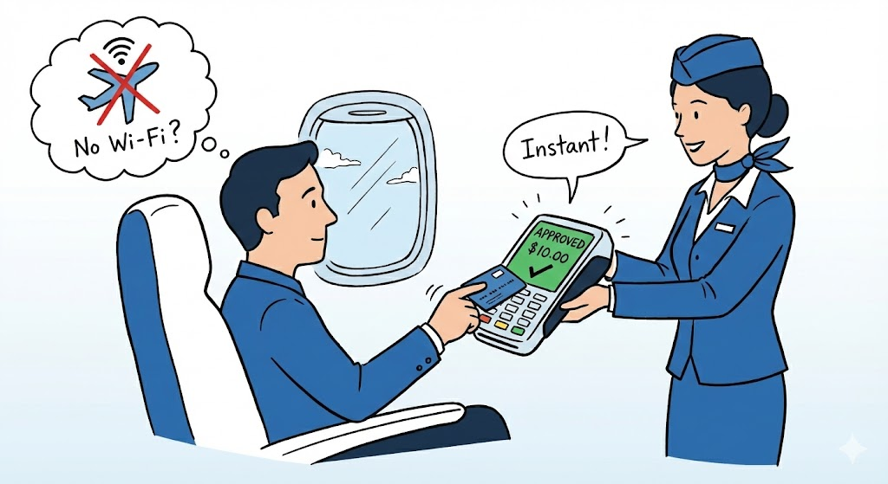

## The Problem

Imagine you’re on a plane with no Wi-Fi. You buy a $10 snack, tap your card, and it says "Approved" instantly.

But there’s no internet. No connection to the bank. So how did your payment get approved so fast? Who said "yes"?

Let’s see who is involved in this scenario and what they want. In this system, every player has their own goal and their own risk.

| Actor | Motivation (The Need) | Ideal Outcome (The Win) | Risks (The Lose) |
| :--- | :--- | :--- | :--- |
| **Customer** | **Pay anytime:** Wants to pay and eat without waiting for a "Connecting" screen. | **Fast approval:** The "Approved" message shows up in less than 1 second. | **Surprise fees:** Finding an unexpected bank fee later because the charge hit late. |
| **Merchant** (Airline) | **Making more sales:** Needs to serve 100 people quickly in a short flight. | **No lost sales:** Every tap works; no food or snacks go to waste. | **Losing money:** Giving away food to a card that is actually declined later. |
| **Acquirer Bank** (Airline Bank) | **Keeping the client:** Wants to provide tech that works so the airline stays with them. | **Easy data sync:** Successfully moving thousands of sales to the bank after landing. | **Software errors:** If the system loses a "batch" of sales, the bank might owe the airline money. |
| **Issuer Bank** (Your Bank) | **Keeping records safe:** Wants to be the main source of truth for your money. | **Earning fees:** Accepting the offline payment and collecting a small fee from the user. | **Stolen cards:** A stolen card being used on many flights before it can be blocked. |
| **Payment Network** (Visa/MC) | **Trust everywhere:** Wants a card from one country to work on a flight in another. | **Fair rules:** Creating clear rules on who pays if a transaction fails. | **Loss of trust:** If offline risk is too high, people might stop trusting cards for travel. |
| **Terminal Provider** | **Strong hardware:** Needs the device to be tough and reliable for flight crews. | **Saving all data:** The device safely stores 100% of the sales in its own memory. | **Losing data:** A battery failure or bug that wipes out the saved sales info. |

## The Challenges & Trade-offs

When a terminal goes offline, it cannot talk to the central bank. This creates two main risks:

* **The Double Spend Risk:** A user might have $0 in their actual account, but the offline terminal doesn't know that.
* **The Sync Conflict**: A passenger spends the same $10 on two different food carts. Since the carts don't talk to each other, the bank only catches the "double-spend" after the plane lands.

In this case, we choose **Availability** (making the payment now) over **Consistency** (verifying the bank balance). The business logic is simple: the benefit of accepting the payment immediately outweighs the risk of a late decline.

## Strategy: Edge Computing

In a normal store, a terminal is just a "messenger." It sends your card info to the bank in the cloud and waits for a "Yes" or "No." This is **Cloud Computing**.

But on a plane, the terminal is cut off. To solve this, we move the compute - the decision-making "brain" - closer to the user (the edge). The terminal becomes an Edge Node. Instead of waiting for the cloud, it authorizes your card locally and make decisions right in the aisle. This is **Edge Computing**.

## The Solution

The EMV Core Protocol performs the technical "heavy lifting" by using the secure microchip on your card to verify identity and enforce bank rules locally.

### 1. Card Chip Solutions (The Protocol)

The chip acts as a secure computer for critical offline safety checks:

- **Identity Handshake (Tag 9F37):** The terminal uses ODA (Offline Data Authentication) to verify digital signatures. It issues a random challenge (Tag 9F37) to ensure the card is legitimate and physically present.

- **Spending Cap (Tag 9F23):** The chip tracks offline taps via an internal accumulator. If the card exceeds the bank's limit (Tag 9F23), the chip declines the sale automatically to prevent overspending.

### 2. Airline & Terminal Solutions (The Business Logic)

The airline handles the remaining part of the transaction by layering its own business rules and recovery methods on top of the protocol:

*This demo focuses on this side.*

- **Merchant Safety Limits:** The airline sets a Floor Limit (e.g., $25) on the terminal. If a snack costs more than this limit, the terminal will refuse to approve it offline to minimize potential loss.

- **Merchant Blacklist:** Before takeoff, the terminal downloads a list of "Risk Customers." This allows the airline to instantly reject cards that have failed to pay on previous flights.

- **Passenger Metadata Mapping:** To ensure they get paid, the terminal maps every tap to the Seat Number and Name from the flight manifest. This info is stored in Tag 9F7C, turning an anonymous card into a trackable purchase.

- **Batch Sync & Recovery:** Uses "Store and Forward" pattern - the terminal saves all transactions locally, then syncs them to the bank after landing. If payments are declined, the airline uses passenger metadata for recovery.