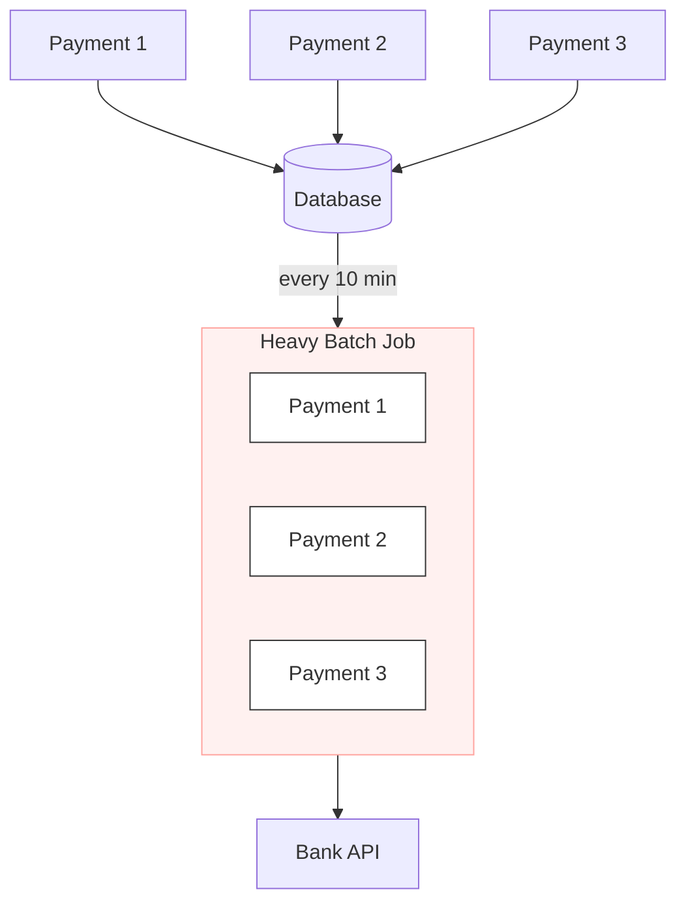
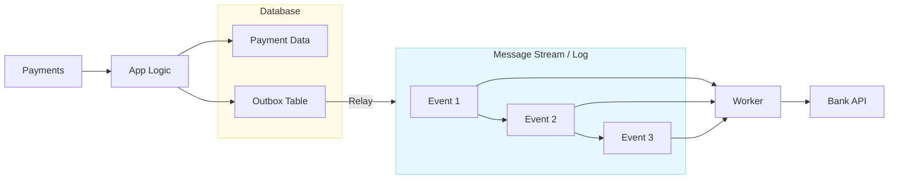

## Purpose
To demonstrate the modernization of the payrun process from batch to stream processing.

## The Legacy Batch Payrun

In the `legacy-batch-payrun`, the system relies on a **Cron job** triggered at fixed intervals (e.g., every 10 minutes).

- **Pattern:** "Pull-based" polling.
- **Logic:** Queries all records with `status = 'PENDING'` and processes payments in a single, synchronous, sequential loop.
- **Transitions:** Linear state changes (`PENDING → PROCESSING → COMPLETED`).

## Issues

- **Processing Lag:** If a user pays at 10:01 and the batch runs at 10:10, the payment sits idle for 9 minutes. This delay makes the app feel slow and unresponsive.

- **Resource Spikes:** The database stays quiet for 9 minutes but suddenly gets slammed with work all at once. This can slow down the app for other users who are just trying to log in or check their balance.

- **Double-Charging Risk:** If the script crashes halfway through, it's hard to tell who was actually paid. Restarting the job might charge the same people twice, requiring manual data cleanup.

- **Data locking:** The batch process locks the records it is working on. This forces other parts of the app to stop and wait for the batch to finish.

## The Stream Payrun

In the `stream-payrun`, instead of periodic polling, the system emits an Event the moment a payment is saved. A dedicated worker listens and processes these payments (the stream) instantly in real-time.

In this architecture, the database is no longer a passive bucket. Instead:

- **Atomic Save:** When a payment is created, the app saves the payment data and a corresponding event to an Outbox Table in a single, safe transaction.
- **Reliable Relay:** A relay process pushes these events into a Message Stream immediately.
- **Isolated Tasks:** The worker handles each payment individually as a distinct task, rather than waiting for a heavy batch window.

### How it solves the problems

- **Zero Lag:** Payments are processed in milliseconds, removing the wait time for the next "batch."
- **No Spikes:** Work is spread out evenly over time, preventing the "resource overload" spikes.
- **Eliminate The Double-Charging Risk:** Using a message log ensures that even if a worker crashes, it knows exactly where it left off.
- **Avoid Table-Locking:** By processing payments individually and asynchronously, we avoid locking large sets of data, keeping the database fast for everyone.